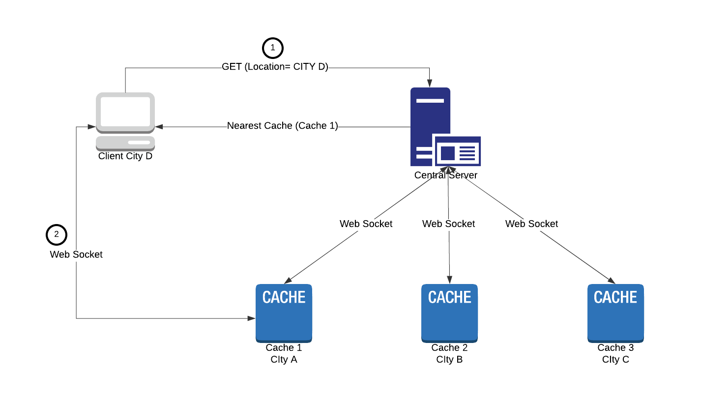

# Ormuco Techinical Test

## Question A
Solution can be found in `ques_a.py`

## Question B
I have attempted to create a version compare system for [Semantic Version 2.0](https://semver.org/). 
Each version is of the form MAJOR.MINOR.PATCH. Additional labels for pre-release can be also added which complicates the comparison a bit.

The precedence rules are mentioned [here](https://semver.org/#spec-item-11). 

function `cmp_version(v1,v2)` in "ques_b.py" returns 0 if both are equal, -1 if v1 < v2  or  1 if v1 > v2

## Question C

The Geo-distributed cache system consists of three parts:
1. A central server  - which keeps a websocket open with each cache and broadcasts any update from one cache to all other caches. It also keeps a list of all connected caches' locations and uses google geocode api to convert location to (lat,lng) coordinates. Now whenever a client requests the nearest cache address, it can use the client location to find and send the nearest cache address back to the client.
2. Cache(s) - which are located in different locations. Each cache keeps a socket open with the central server to send/receive updates. It can also open a socket with one or more clients and send them required data.
3. Clients - These first send their location to the central server and get the nearest cache address back. Then they request the cache to open a socket to exchange data.

The following diagram illustrates this system:

### Running the files:
- To run the server - `python server.py` in a terminal. Add google maps API key with Geolocation enabled in `geo_helper.py`. By default it is running at http://localhost:8080 (for demo purposes).
- For the demo, cache.py needs to be run with two arguments - city name and host:port. For example  `python cache.py toronto http://localhost:9090 ` . Multiple cache instances can be run with different city names and port numbers.Instead of typing the city name, a real world deployment would likely use the Geolocation API. Typing the city name make simulating different cache locations easier here.
- client.py  - needs to be run with a city name as argument to simulate its current location, for example -`python client.py montreal
` . This gets sent to the server which uses this location and all the cache locations to find the nearest cache. It then connects and opens a websocket with the nearest cache.

python libraries used:
 - socket.io : for websockets
 - aiohttp : for simple web server
 - requests : for making http get requests

 It is straightforward to use client.py as all it would need is the central server address. Time expiration part is't implemented yet (it was superbowl sunday) but it shouldn't be too difficult.
 There is also a short demo video in the project named `ques3_demo.mp4`